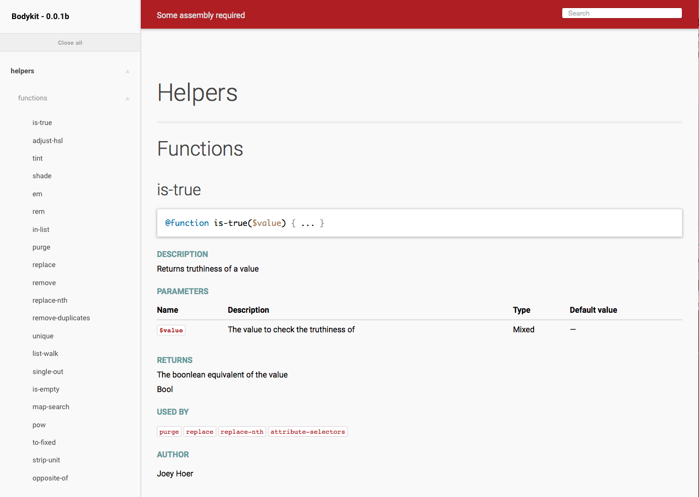

Bodykit
=======

####_"Simplify, then add lightness"_  – Colin Chapman

Bodykit is designed to improve frontend web development by providing abstractions of frequently used styling patterns. It's a build your own solution that can scale to fit various sized projects.

Some Assembly Required
----------------------
Bodykit is first and foremost a SASS tool set, designed to be style agnostic, and providing developers with pieces to assemble and paint as they see fit. It does not add a single line to your code until you've called a mixin or function, there's no defined classes, and no pre-generated code that you have figure out how to patch into your project. Installation is as simple as moving bodykit to your lib/sources folder in your SASS directory, and then importing it to your project.

     @import path_to_lib/bodykit/bodykit;

Top Mixins & Functions
----------------------
Here are some of the top Mixins in Bodykit, each has directions for use, as well as details on any variables or caveats if applicable.
1. [Ad-Infinitum](https://github.com/gaugeinteractive/bodykit/blob/master/src/mixins/_ad-infinitum.scss)
2. [Responsive-Tables](https://github.com/gaugeinteractive/bodykit/blob/master/src/mixins/_responsive-table.scss)
3. [Line-On-Sides](https://github.com/gaugeinteractive/bodykit/blob/master/src/mixins/_line-on-sides.scss)

Links To Bodykit In Use
----------------------
Some real world examples of bodykit in use on a variety of platforms.

[Savannah Bee Co.](http://savannahbee.com)

[Infowars Store](http://infowarsstore.com)

[AskDerm](http://askderm.com)

[Orafol Vehicle Wraps](http://orafolvehiclewraps.com)

Running Tests
-------------

The test suite requires [minitest](https://github.com/seattlerb/minitest), which can be installed with:

    gem install minitest

Tests can be run with:

    ruby test.rb

Further Documentation
-------------

Bodykit uses [SassDoc](https://github.com/SassDoc/) for in-depth documentation on each mixin/function. To make use of this clone the repo to your local environment and checkout the gh-pages branch. You can then visit the page in your browser to see the documentation.

